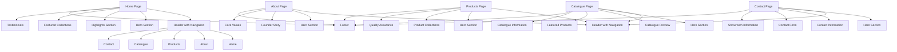

# Kumudhini Silks Website Structure

```mermaid
graph TD
    A[Home Page] --> B[Header with Navigation]
    A --> C[Hero Section]
    A --> D[Highlights Section]
    A --> E[Featured Collections]
    A --> F[Testimonials]
    A --> G[Footer]

    H[About Page] --> I[Header with Navigation]
    H --> J[Hero Section]
    H --> K[Founder Story]
    H --> L[Core Values]
    H --> G

    M[Products Page] --> I
    M --> N[Hero Section]
    M --> O[Product Collections]
    M --> P[Quality Assurance]
    M --> G

    Q[Catalogue Page] --> I
    Q --> R[Hero Section]
    Q --> S[Catalogue Preview]
    Q --> T[Featured Products]
    Q --> U[Catalogue Information]
    Q --> G

    V[Contact Page] --> I
    V --> W[Hero Section]
    V --> X[Contact Information]
    V --> Y[Contact Form]
    V --> Z[Showroom Information]
    V --> G

    B --> AA[Home]
    B --> AB[About]
    B --> AC[Products]
    B --> AD[Catalogue]
    B --> AE[Contact]
```